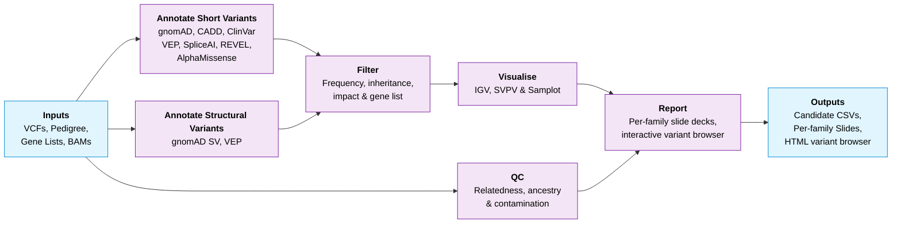

# nf-cavalier

Nextflow pipeline for singleton and family based candidate variant reporting based on gene lists. Variants are reported in CSV, Powerpoint and PDF format. Supports joint SNV/Indel and Structural Variant analysis.

## Overview
* Variants are annotated with vcfanno, svafotate and VEP
* Variants are filtered by family based on inheritance, population frequency, predicted impact and gene lists
* Candidate variants are reported along with IGV and Structural variant visualisations



## Prerequisites
* [Nextflow](https://www.nextflow.io/) >= 24.04
* A container runtime: [Docker](https://www.docker.com/), [Singularity](https://sylabs.io/singularity/) or [Apptainer](https://apptainer.org/)

## Installation
* Clone this repository

## Usage
1. Create and navigate to run working directory
2. Download required annotation sources - see [annotations](#annotations)
3. Create a configuration file named `nextflow.config` in the run directory - see [parameters](#parameters) for all options. Minimal example:
    ```nextflow
    params {
        // Inputs
        alignments = 'alignments.tsv'
        ped        = 'family.ped'          // omit for singletons
        short_vcf  = 'cohort.snv.vcf.gz'
        struc_vcf  = 'cohort.sv.vcf.gz'
        lists      = 'PAA:202,my_genes.tsv'

        // Reference
        ref_fasta = '/path/to/GRCh38.fasta'
        ref_gene  = '/path/to/ncbiRefSeqSelect.tsv'

        // VEP
        vep_cache          = '/path/to/vep_cache'
        vep_cache_ver      = '115'
        vep_spliceai_snv   = '/path/to/spliceai_scores.masked.snv.hg38.vcf.gz'
        vep_spliceai_indel = '/path/to/spliceai_scores.masked.indel.hg38.vcf.gz'
        vep_alphamissense  = '/path/to/AlphaMissense_hg38.tsv.gz'
        vep_revel          = '/path/to/new_tabbed_revel_grch38.tsv.gz'
        vep_utr_annotator  = '/path/to/uORF_5UTR_GRCh38_PUBLIC.txt'

        // Annotation databases - see Annotations section
        vcfanno_gnomad     = '/path/to/gnomad.joint.v4.1.vcf.gz'
        vcfanno_cadd_snv   = '/path/to/whole_genome_SNVs.tsv.gz'
        vcfanno_cadd_indel = '/path/to/gnomad.genomes.r4.0.indel.tsv.gz'
        vcfanno_clinvar    = '/path/to/clinvar.vcf.gz'
        svafdb             = '/path/to/SVAFotate_core_SV_popAFs.GRCh38.v4.1.bed.gz'
    }
    ```
4. Run nf-cavalier  
  
    ```
    nextflow run /PATH/TO/nf-cavalier -resume
    ```
### Bahlolab users only
* Do not need to download annotations sources and can use the preconfigured profile:
    ```
    nextflow run /PATH/TO/nf-cavalier -resume -profile bahlolab
    ```
  
## Parameters
The following parameters may be set in the Nextflow configuration file:
### Required
| Parameter | Default | Description |
|-----------|---------|-------------|
| `alignments` | - | TSV file with alignment file paths (Col 1: sample ID, Col 2: BAM or CRAM path) |
| `lists` | - | Gene lists, comma separated (TSV or ID) - [see below](#gene-lists) |
| `ped` | - | Pedigree file (required for familial analysis; omit for singleton analysis) [see below](#pedigree) |
| `short_vcf` | - | Input VCF for short variants (SNVs/Indels) — at least one of `short_vcf`/`struc_vcf` required |
| `struc_vcf` | - | Input VCF for structural variants — at least one of `short_vcf`/`struc_vcf` required |
| `ref_fasta` | - | GRCh38 reference FASTA file |
| `vep_cache` | - | VEP cache directory - [see here](https://www.ensembl.org/info/docs/tools/vep/script/vep_cache.html) |
| `vep_cache_ver` | `'115'` | VEP cache version |
| `vep_utr_annotator` | - | UTR Annotator file - [see below](#vep-plugins)|
| `vep_spliceai_snv` | - | SpliceAI SNV VCF path (available from Illumina) - [see below](#vep-plugins)|
| `vep_spliceai_indel` | - | SpliceAI Indel VCF path (available from Illumina) - [see below](#vep-plugins)|
| `vep_alphamissense` | - | AlphaMissense annotation file (TSV) - [see below](#vep-plugins)|
| `vep_revel` | - | REVEL annotation file (TSV) - [see below](#vep-plugins) |
| `vcfanno_gnomad` | - | gnomAD 4.1 callset vcf.gz, with INFO: AC, AF, fafmax_faf95_max, nhomalt  [see below](#gnomad-4.1) |
| `vcfanno_cadd_snv` | - | CADD 1.7 SNV TSV [see below](#cadd) |
| `vcfanno_cadd_indel` | - | CADD 1.7 gnomad indel TSV  |
| `vcfanno_clinvar` | - | ClinVar VCF, with INFO: CLNSIG, GENEINFO and ID [see below](#clinvar) |
| `svafdb` | - | SVAFotate database path [see below](#SVAFotate)|
| `ref_gene` | - | NCBI RefSeq Select (UCSC) TSV - [available here](https://genome.ucsc.edu/cgi-bin/hgTables?hgsid=3670191553_zqnYvk2x5XApGbDxqWZWmWYbAFNP&clade=mammal&org=&db=hg38&hgta_group=genes&hgta_track=refSeqComposite&hgta_table=ncbiRefSeqSelect&hgta_regionType=genome&position=&hgta_outputType=primaryTable&hgta_outFileName=ncbiRefSeqSelect.tsv) |

### Optional

**General**
| Parameter | Default | Description |
|-----------|---------|-------------|
| `outdir` | `'output'` | Output directory |
| `annotate_only` | `false` | Only performs annotation, no filtering or reporting of variants |
| `make_slides` | `true` | Output PPT/PDF slides |

**Short Variant Processing**
| Parameter | Default | Description |
|-----------|---------|-------------|
| `short_vcf_annotated` | `null` | Pre-annotated short variant VCF (skips annotation) |
| `short_n_shards` | `200` | Split input VCF into shards for parallel processing |
| `short_vcf_filter` | `"PASS,."` | Apply filter to input short variants |
| `short_info` | `['AC', 'AF', 'AN']` | INFO fields to keep from VCF |
| `short_format` | `['GT', 'GQ', 'DP']` | FORMAT fields to keep from VCF |
| `short_fill_tags` | `false` | Fill AC, AF, and AN from VCF |
| `short_vcfanno_filter` | `'gnomad_AF<0.01 \|\| gnomad_AF="."'` | Filter to apply after vcfanno |
| `vep_check` | `true` | Check number of variants output by VEP equal to number input |

**Short Variant Filters**
| Parameter | Default | Description |
|-----------|---------|-------------|
| `FILTER_SHORT_MIN_DP` | `5` | Minimum depth |
| `FILTER_SHORT_MIN_GQ` | `10` | Minimum genotype quality |
| `FILTER_SHORT_POP_DOM_MAX_AF` | `0.0001` | Max population AF for dominant variants |
| `FILTER_SHORT_POP_REC_MAX_AF` | `0.01` | Max population AF for recessive variants |
| `FILTER_SHORT_POP_DOM_MAX_AC` | `10` | Max population AC for dominant variants |
| `FILTER_SHORT_POP_REC_MAX_AC` | `1000` | Max population AC for recessive variants |
| `FILTER_SHORT_POP_DOM_MAX_HOM` | `1` | Max population homozygotes for dominant variants |
| `FILTER_SHORT_POP_REC_MAX_HOM` | `10` | Max population homozygotes for recessive variants |
| `FILTER_SHORT_COH_DOM_MAX_AF` | `null` | Max cohort AF for dominant variants |
| `FILTER_SHORT_COH_REC_MAX_AF` | `null` | Max cohort AF for recessive variants |
| `FILTER_SHORT_COH_DOM_MAX_AC` | `null` | Max cohort AC for dominant variants |
| `FILTER_SHORT_COH_REC_MAX_AC` | `null` | Max cohort AC for recessive variants |
| `FILTER_SHORT_CLINVAR_LIST_ONLY` | `true` | Restrict ClinVar reporting to list genes only |
| `FILTER_SHORT_CLINVAR_KEEP_PAT` | `'(p\|P)athogenic(?!ity)'` | Regex for keeping ClinVar pathogenic variants |
| `FILTER_SHORT_CLINVAR_DISC_PAT` | `'(b\|B)enign'` | Regex for discarding ClinVar benign variants |
| `FILTER_SHORT_LOF` | `true` | Enable TYPE='LOF' (VEP IMPACT == 'HIGH') |
| `FILTER_SHORT_MISSENSE` | `true` | Enable TYPE='MISSENSE' (VEP CSQ contains 'missense') |
| `FILTER_SHORT_SPLICING` | `true` | Enable TYPE='SPLICING' |
| `FILTER_SHORT_PROMOTER` | `false` | Enable TYPE='PROMOTER' variant class |
| `FILTER_SHORT_OTHER` | `true` | Enable TYPE='OTHER' (VEP MODERATE impact variants not covered by other types) |
| `FILTER_SHORT_MIN_CADD_PP` | `25.3` | Minimum CADD Phred score to force inclusion in results |
| `FILTER_SHORT_MIN_SPLICEAI_PP` | `0.20` | Minimum SpliceAI score to force inclusion in results |
| `FILTER_SHORT_VEP_MIN_IMPACT` | `'MODERATE'` | Minimum VEP impact to retain |
| `FILTER_SHORT_VEP_CONSEQUENCES` | `null` | Specific VEP consequences to retain |

**Structural Variant Processing**
| Parameter | Default | Description |
|-----------|---------|-------------|
| `struc_vcf_annotated` | `null` | Pre-annotated structural variant VCF (skips annotation) |
| `struc_n_shards` | `20` | Number of shards for parallel SV processing |
| `struc_vcf_filter` | `"PASS,."` | Apply VCF filter to structural variant VCF |
| `struc_info` | `['AC', 'AF', 'AN', 'SVTYPE', 'SVLEN', 'END']` | INFO fields to keep from SV VCF |
| `struc_format` | `['GT']` | FORMAT fields to keep from SV VCF |
| `struc_fill_tags` | `false` | Fill AC, AF, AN tags for SVs |

**Structural Variant Filters**
| Parameter | Default | Description |
|-----------|---------|-------------|
| `FILTER_STRUC_POP_DOM_MAX_AF` | `0.0001` | Max population AF for dominant SVs |
| `FILTER_STRUC_POP_REC_MAX_AF` | `0.01` | Max population AF for recessive SVs |
| `FILTER_STRUC_POP_DOM_MAX_HOM` | `null` | Max population homozygotes for dominant SVs |
| `FILTER_STRUC_POP_REC_MAX_HOM` | `null` | Max population homozygotes for recessive SVs |
| `FILTER_STRUC_COH_DOM_MAX_AF` | `0.01` | Max cohort AF for dominant SVs |
| `FILTER_STRUC_COH_REC_MAX_AF` | `0.01` | Max cohort AF for recessive SVs |
| `FILTER_STRUC_COH_DOM_MAX_AC` | `null` | Max cohort AC for dominant SVs |
| `FILTER_STRUC_COH_REC_MAX_AC` | `null` | Max cohort AC for recessive SVs |
| `FILTER_STRUC_SVTYPES` | `'DEL,DUP,INS,INV'` | SV types to retain |
| `FILTER_STRUC_VEP_MIN_IMPACT` | `'LOW'` | Minimum VEP impact for SVs |
| `FILTER_STRUC_VEP_CONSEQUENCES` | `'coding_sequence_variant,non_coding_transcript_exon_variant,TFBS_ablation,regulatory_region_ablation'` | Specific VEP consequences to keep for SVs |
| `FILTER_STRUC_LARGE_LENGTH` | `null` | Automatically report SVs larger than this length |

**Reporting**
| Parameter | Default | Description |
|-----------|---------|-------------|
| `max_short_per_deck` | `500` | Maximum number of short variants per slide deck |
| `max_struc_per_deck` | `500` | Maximum number of structural variants per slide deck |
| `SLIDE_INFO_SHORT` | `[Map]` | Fields to include in short variant slides - [see below](#slide-info)|
| `SLIDE_INFO_STRUC` | `[Map]` | Fields to include in structural variant slides - [see below](#slide-info)|

### Gene Lists
* Gene lists are passed as a comma separated set of gene lists to use for filtering. This may be a local TSV file, e.g. 'my_gene_list.tsv' or a web based gene list, e.g. [PAA:289](https://panelapp.agha.umccr.org/panels/289/).
    * **Local TSV file**  
      * Path to a gene list TSV file. The file should have at least one of the following column names:
     `ensembl_gene_id`, `hgnc_id`, `entrez_id` or `symbol`. Optional column names are `list_id`, `list_name`, `list_version` and `inheritance`. Note that all gene IDs are converted to Ensembl Gene IDs using HGNC to match the VEP annotation.
     
         e.g.

          ```
          list_id	list_name	list_version	symbol	inheritance
          PAA:202	Genetic Epilepsy	1.26	AARS1	AR
          PAA:202	Genetic Epilepsy	1.26	ABAT	AR
          PAA:202	Genetic Epilepsy	1.26	ABCA2	AR
          ```
          
          or:
          
            list_id	list_name	list_version	ensembl_gene_id	inheritance
            PAA:202	Genetic Epilepsy	1.26	ENSG00000090861	AR
            PAA:202	Genetic Epilepsy	1.26	ENSG00000183044	AR
            PAA:202	Genetic Epilepsy	1.26	ENSG00000107331	AR
              
    * **Web List** - Cavalier will automatically retrieve the latest version of these web lists
      * **PanelApp**: PanelApp Australia or PanelApp Genomics England lists may be specified with "PAA:" or "PAE:" prefix respectively. e.g. [PAA:202](https://panelapp-aus.org/panels/202/)
      * **HPO**: Human phenotype ontology terms may be specified with the "HP:" prefix, e.g. [HP:0001250](https://hpo.jax.org/browse/term/HP:0001250)
      * **Genes4Epilepsy**: [Genes4Epilepsy](https://github.com/bahlolab/Genes4Epilepsy) lists may be specified with the "G4E:" prefix, e.g. "G4E:ALL" for All Epilepsy genes, or "G4E:Focal" for Focal epilepsy genes only (options: "ALL", "Focal", "MCD", "DEE", "PME", "GGE").
      * **HGNC**: Gene subsets by locus group can be extracted from HGNC, for example "HGNC:protein-coding" will give a list of all protein coding genes
    * **Genomic Region** - by specifying a genomic region such as "chr1:1000000-2000000", cavalier will extract all ensemble/gencode genes in that region.

### Pedigree
* The pedigree file must contain rows for all labelled family members to draw pedigree. When provided, only variants that segregate perfectly with phenotype will be reported. Format is a TSV file with 6 columns: **Family ID**, **Individual ID**, **Paternal ID**, **Maternal ID**, **Sex** (male: 1, female: 2), **Phenotype** (unaffected: 1, affected: 2). Column names should not be included.

### Slide Info
* Output slides contain a table reporting variant and gene level information
* The defaults for short and structural variants are:
  ```nextflow
  params {
      SLIDE_INFO_SHORT = [
            DEFAULT: [
                Gene         : 'Gene',
                Inheritance  : 'inheritance', 
                Consequence  : 'Consequence',
                HGVS         : 'HGVS',
                ClinVar      : 'CLNSIG',
                'gnomAD v4.1': 'gnomAD', 
                Cohort       : 'Cohort',
                PhyloP100    : 'phyloP100',
                'CADD v1.7'  : 'CADD',
            ],
            MISSENSE: [
                REVEL        : 'REVEL',
                AlphaMissense: 'AlphaMissense',
                SIFT         : 'SIFT',
                PolyPhen     : 'PolyPhen',
            ],
            SPLICING: [
                SpliceAI     : 'SpliceAI',
            ]
        ]
      SLIDE_INFO_STRUC = [
          DEFAULT: [
              Gene         : 'Gene',
              Inheritance  : 'inheritance', 
              Consequence  : 'Consequence',
              HGVS         : 'HGVS',
             'SV Type'     : 'SVTYPE',
              Region       : 'Region',
              Length       : 'SVLEN',
              'gnomAD v4.1': 'gnomAD',
              Cohort       : 'Cohort'
          ]
      ]
  }
  ```
* "DEFAULT" fields are reported for all variants of each class. Named sections (e.g. "MISSENSE", "SPLICING") are appended only for variants of that type.

## Annotations
### CADD
* CADD 1.7 downloads are available [here](https://cadd.gs.washington.edu/download), required files:
  * whole_genome_SNVs.tsv.gz
  * whole_genome_SNVs.tsv.gz.tbi
  * gnomad.genomes.r4.0.indel.tsv.gz
  * gnomad.genomes.r4.0.indel.tsv.gz.tbi
* set parameters `vcfanno_cadd_snv` and `vcfanno_cadd_indel`
### ClinVar
* ClinVar VCFs and TBI may be downloaded [here](https://ftp.ncbi.nlm.nih.gov/pub/clinvar/vcf_GRCh38/weekly/)
* These should be regularly updated to keep results current
* Set parameter `vcfanno_clinvar`
### GnomAD 4.1
* The joint callset is available [here](https://gnomad.broadinstitute.org/data#v4-joint-freq-stats)
* Chromosomal VCFs need to be downloaded, merged into a single file, and indexed (this can be done with `bcftools`)
* Extracting only required annotations -  AC, AF, fafmax_faf95_max, nhomalt - will reduce file size massively (`bcftools annotate -x`)
* Set parameter `vcfanno_gnomad`
### VEP Plugins
* Cavalier makes use of VEP plugins, see the following links for details on how to download:
  * [REVEL](https://www.ensembl.org/info/docs/tools/vep/script/vep_plugins.html#revel)
  * [SpliceAI](https://www.ensembl.org/info/docs/tools/vep/script/vep_plugins.html#spliceai)
  * [UTRannotator](https://www.ensembl.org/info/docs/tools/vep/script/vep_plugins.html#utrannotator)
  * [AlphaMissense](https://www.ensembl.org/info/docs/tools/vep/script/vep_plugins.html#alphamissense)
* Set parameters `vep_spliceai_snv`, `vep_spliceai_indel`, `vep_revel`, `vep_utr_annotator` and `vep_alphamissense`
### SVAFotate
* [SVAFotate](https://github.com/fakedrtom/SVAFotate) is used to annotate gnomAD v4.1 SV frequencies
* The database file is available [here](https://zenodo.org/records/11642574)
* Set parameter `svafdb`