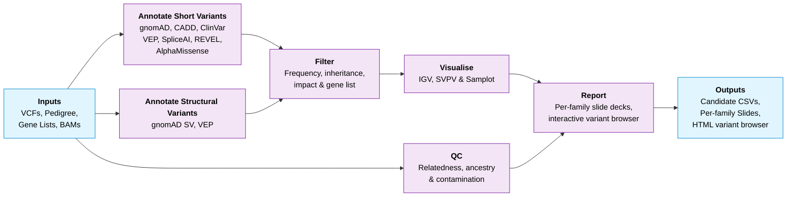

# nf-cavalier

Nextflow pipeline for singleton and family-based candidate variant reporting based on gene lists. Variants are reported in CSV, PowerPoint and PDF format. Supports joint SNV/Indel and Structural Variant analysis.

## Pipeline summary
* Variants are annotated with vcfanno, SVAFotate and VEP.
* Variants are filtered by family based on inheritance, population frequency, predicted impact and gene lists.
* Candidate variants are reported along with IGV and Structural variant visualisations.



## Quick start

Requires [Nextflow](https://www.nextflow.io/) ≥ 24.04 and a container runtime (Docker / Singularity / Apptainer).

```bash
# 1. Clone the pipeline
git clone https://github.com/bahlolab/nf-cavalier.git

# 2. Set up annotation reference data (writes a populated nextflow.config)
nextflow run nf-cavalier/setup_anno/setup_anno.nf \
    --resource_dir ./cavalier_refdata \
    --config_out   ./nextflow.config

# 3. Append your inputs to nextflow.config
cat >> nextflow.config <<'EOF'
params {
    alignments = 'alignments.tsv'
    ped        = 'family.ped'           // omit for singletons
    short_vcf  = 'cohort.snv.vcf.gz'
    struc_vcf  = 'cohort.sv.vcf.gz'
    lists      = 'PAA:202,my_genes.tsv'
}
EOF

# 4. Run the pipeline
nextflow run nf-cavalier -resume
```

Bahlolab users can skip step 2 and run with `-profile bahlolab`.

See [docs/usage.md](docs/usage.md) for the full guide, including the input file formats (alignments TSV, gene lists, pedigree).

## Test dataset

An end-to-end example built from the public **1000G CEPH trio** (chr22) is provided in `tests/ceph_trio/`. See [docs/test_dataset.md](docs/test_dataset.md) for how to download the inputs and run it.

## Outputs
Per-family slide decks (PPTX/PDF), candidate-variant CSVs, an interactive HTML variant browser, and QC reports — all under `${params.outdir}`. See [docs/output.md](docs/output.md) for the full layout.

## Documentation
* [Usage](docs/usage.md) — prerequisites, install, running the pipeline, and input file formats (alignments TSV, gene lists, pedigree, slide info).
* [Annotations](docs/annotations.md) — `setup_anno` workflow and per-source download notes.
* [Parameters](docs/parameters.md) — every parameter with defaults and descriptions.
* [Outputs](docs/output.md) — what the pipeline writes and where.
* [Test dataset](docs/test_dataset.md) — 1000G CEPH trio example (download + run).

## Credits
nf-cavalier is developed and maintained at [WEHI](https://www.wehi.edu.au/) by:
* **Jacob Munro** — author, maintainer ([@jemunro](https://github.com/jemunro), [ORCID](https://orcid.org/0000-0002-2751-0989))
* **Mark Bennett** — author, maintainer ([@mfbennett](https://github.com/mfbennett), [ORCID](https://orcid.org/0000-0002-3561-6804))
* **Joshua Reid** — contributor ([@joshreid1](https://github.com/joshreid1), [ORCID](https://orcid.org/0000-0003-1925-7474))

---

> **Home** &ensp;·&ensp; [Usage](docs/usage.md) &ensp;·&ensp; [Annotations](docs/annotations.md) &ensp;·&ensp; [Parameters](docs/parameters.md) &ensp;·&ensp; [Output](docs/output.md) &ensp;·&ensp; [Test Dataset](docs/test_dataset.md)
